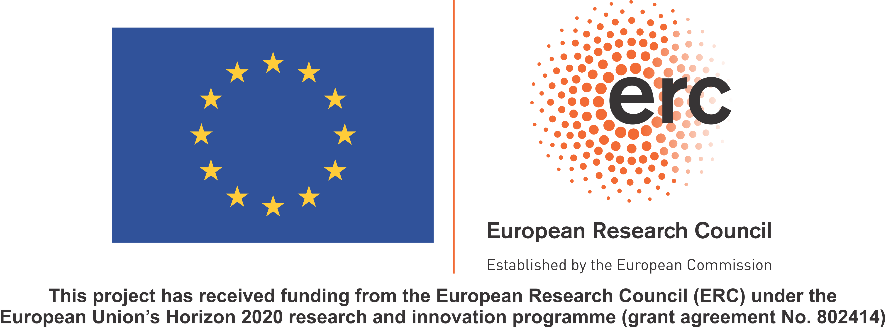

# WALIS

This is the public repository page for the World Atlas of Last Interglacial Shorelines (WALIS). It contains python scripts and Jupyter notebooks to download, query and analyse the data included in the Atlas. More information on the project can be found at [this page](https://warmcoasts.eu/world-atlas).

## Data
The data in WALIS is organized in a [Zenodo Community](https://zenodo.org/communities/walis_database/). A series of manuscripts in a Special Issue of the journal [Earth System Science Data](https://essd.copernicus.org/articles/special_issue1055.html)
 describes each region included in the database.
 
## Contents

### Folders
The notebooks are stored in the root (/WALIS). Within the root, there are three sub-folders, as listed below.

1. **Output** This folder stores the files exported by the notebooks. The **/data** subfolder contains the database in various formats.
2. **scripts** This folder stores all the python scripts called by the notebooks.
3. **Conda_env** In this folder are stored two files: _requirements.txt_ _and WALIS_env.yml_ that can be used to download the python packages required to run the scripts and creating the Conda environment.

### Jupyter Notebooks
#### Query and explore data
This notebook contains scripts that allow querying and extracting data from the "World Atlas of Last Interglacial Shorelines" (WALIS) database. The notebook calls scripts contained in the /scripts folder. After downloading the database (internet connection required), field headers are renamed, and field values are substituted, following 1:n or n:n relationships. The tables composing the database are then saved in CSV, XLSS (multi-sheet), and geoJSON formats. The notebook also contains some plotting functions.
#### Export data for ShinyAppp
This notebook contains the scripts to download the full WALIS database and prepare a CSV file for the R Shiny App hosted [here](https://warmcoasts.shinyapps.io/WALIS_Visualization/). 

## Other WALIS resources
We maintain a repository with the scripts for a [visualization interface](https://github.com/Alerovere/WALIS_Visualization) for WALIS data, coded in R. Field descriptors for the WALIS database are available in a [ReadTheDocs](https://walis-help.readthedocs.io) webpage.
These are also deposited in Zenodo:

Garzón and Rovere (2021) 

Rovere et al. (2020) 

### Suggested acknowledgments
WALIS is the result of the work of several people, within different projects. For this reason, we kindly ask you to follow these simple rules to properly acknowledge those who worked on it:

1. Cite the original authors - Please maintain the original citations for each datapoint, to give proper credit to those who worked to collect the original data in the field or in the lab.
2. Acknowledge the database contributor - The name of each contributor is listed in all public datapoints. This is the data creator, who spent time to make sure the data is standardized and (as much as possible) free of errors.
3. Acknowledge the database structure and interface creators - The database template used in this study was developed by the ERC Starting Grant "WARMCOASTS" (ERC-StG-802414) and is a community effort under the PALSEA (PAGES / INQUA) working group.

Example of acknowledgments: The data used in this study were *extracted from / compiled in* WALIS, a sea-level database interface developed by the ERC Starting Grant "WARMCOASTS" (ERC-StG-802414), in collaboration with PALSEA (PAGES / INQUA) working group. The database structure was designed by A. Rovere, D. Ryan, T. Lorscheid, A. Dutton, P. Chutcharavan, D. Brill, N. Jankowski, D. Mueller, M. Bartz, E. Gowan and K. Cohen. The data points used in this study were contributed to WALIS by *list names of contributors here*.

### Funding
This software is part of a project that has received funding from the European Research Council (ERC) under the European Union’s Horizon 2020 research and innovation programme (Grant agreement No. ERC-StG-802414)

### Code Acknowledgments
Thank you to all those who take time answering questions on various webpages!

https://stackoverflow.com/questions/59617019/replace-comma-separated-values-in-a-dataframe-with-values-from-another-dataframe/59617707#59617707

https://stackoverflow.com/questions/53818434/pandas-replacing-values-by-looking-up-in-an-another-dataframe

https://gis.stackexchange.com/questions/147156/making-shapefile-from-pandas-dataframe

https://riptutorial.com/pandas/example/25462/split--reshape--csv-strings-in-columns-into-multiple-rows--having-one-element-per-row

https://stackoverflow.com/questions/56466917/is-there-a-way-in-pandas-to-remove-duplicates-from-within-a-series

https://stackoverflow.com/questions/185936/how-to-delete-the-contents-of-a-folder

http://michael-harmon.com/blog/IntroToBokeh.html

https://stackoverflow.com/questions/37877708/how-to-turn-a-pandas-dataframe-row-into-a-comma-separated-string

https://stackoverflow.com/questions/53082639/python-removing-the-contents-of-a-cell-based-on-a-specific-condition

https://www.codeproject.com/Articles/56371/Finding-Probability-Distribution-Parameters-from-P

https://stackoverflow.com/questions/44281863/saving-html-file-with-images-in-bokeh

https://stackoverflow.com/questions/1855095/how-to-create-a-zip-archive-of-a-directory-in-python

https://stackoverflow.com/questions/57507321/make-bokeh-plot-fill-the-entire-screen

https://stackoverflow.com/questions/58162200/pre-determine-optimal-level-of-zoom-in-folium

https://rawgit.com/agaidus/leaflet_webmaps_python/master/sf_crime_mapping_final.html

https://github.com/dmvianna/leaflet_webmaps_python/blob/functional/sf_crime_mapping_final.ipynb

https://towardsdatascience.com/collect-and-visualize-covid-19-data-336e4dc9ead

https://stackoverflow.com/questions/11882393/matplotlib-disregard-outliers-when-plotting

https://stackoverflow.com/questions/3279560/reverse-colormap-in-matplotlib

https://stackoverflow.com/questions/18012505/python-pandas-dataframe-columns-convert-to-dict-key-and-value
